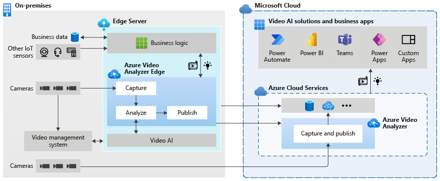

# Deprecated - Azure Video Analyzer

We’re retiring the Azure Video Analyzer preview service, you're advised to transition your applications off of Video Analyzer by 01 December 2022. This repo is no longer being maintained.

## Introduction

[Azure Video Analyzer](https://azure.microsoft.com/products/video-analyzer) (AVA) provides a platform for you to build intelligent video applications that span the edge and the cloud. The platform consists of an IoT Edge module and an Azure service. It offers the capability to capture, record, and analyze live videos and publish the results, namely video and insights from video, to edge or cloud.

## Azure Video Analyzer on IoT Edge

Azure Video Analyzer is an [IoT Edge module](http://docs.microsoft.com/azure/marketplace/iot-edge-module) which offers functionality that can be combined with other Azure edge modules such as Stream Analytics on IoT Edge, Cognitive Services on IoT Edge as well as Azure services in the cloud such as Event Hub, Cognitive Services, etc. to build powerful hybrid (i.e. edge + cloud) applications. Video Analyzer is designed to be a pluggable platform, enabling you to plug video analysis edge modules (e.g. Cognitive services containers, custom edge modules built by you with open source machine learning models or custom models trained with your own data) and use them to analyze live video without worrying about the complexity of building and running a live video pipeline.

With Video Analyzer, you can continue to use your CCTV cameras with your existing video management systems (VMS) and build video analytics apps independently. Video Analyzer can be used in conjunction with existing computer vision SDKs and toolkits to build cutting edge hardware accelerated live video analytics enabled IoT solutions. Apart from analyzing live video, the edge module also enables you to optionally record video locally on the edge or to the cloud, and to publish video insights to Azure services (on the edge and/or in the cloud). If video and video insights are recorded to the cloud, then the Video Analyzer cloud service can be used to manage them.

The Video Analyzer cloud service can therefore be also used to enhance IoT solutions with VMS capabilities such as recording, playback, and exporting (generating video files that can be shared externally). It can also be used to build a cloud-native solution with the same capabilities, as shown in the diagram below, with cameras connecting directly to the cloud.

 

  

 

## This repo

This repository is a starting point to learn about and engage in Video Analyzer open source projects.This repository is not an official Video Analyzer product support location, however, we will respond to issues filed here as best we can.

## Contributing

This project welcomes contributions and suggestions. Most contributions require you to agree to a Contributor License Agreement (CLA) declaring that you have the right to, and actually do, grant us the rights to use your contribution. For details, visit [https://cla.opensource.microsoft.com](https://cla.opensource.microsoft.com).

When you submit a pull request, a CLA bot will automatically determine whether you need to provide a CLA and decorate the PR appropriately (e.g., status check, comment). Simply follow the instructions provided by the bot. You will only need to do this once across all repos using our CLA.

To find opportunities for contributions, please search for "Contributions needed" section in Readme.md of any folder.

## License

This repository is licensed with the [MIT license](https://github.com/Azure/live-video-analytics/blob/master/LICENSE).

## Microsoft Open Source Code of Conduct

This project has adopted the [Microsoft Open Source Code of Conduct](https://opensource.microsoft.com/codeofconduct/).

Resources:

- [Microsoft Open Source Code of Conduct](https://opensource.microsoft.com/codeofconduct/)
- [Microsoft Code of Conduct FAQ](https://opensource.microsoft.com/codeofconduct/faq/)
- Contact [opencode@microsoft.com](mailto:opencode@microsoft.com) with questions or concerns
