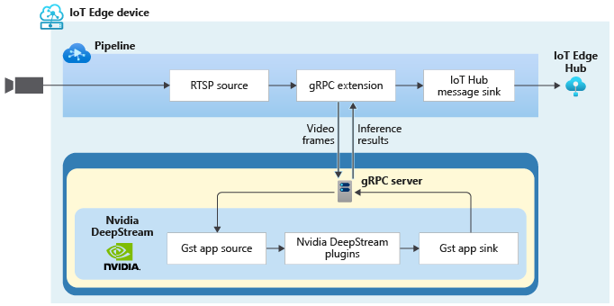

# Azure Video Analyzer (AVA) with NVIDIA DeepStream

The following instructions will enable you to build a Docker container with a [gRPC](https://grpc.io/) server that can receive messages from AVA on IoT Edge module, and use a [GStreamer](https://gstreamer.freedesktop.org/) pipeline with video analytics plugins from [NVIDIA DeepStream](https://docs.nvidia.com/metropolis/deepstream/dev-guide/index.html) (licensed under MIT license).




Additional open source technologies included are [nginx](https://www.nginx.com/), [gunicorn](https://gunicorn.org/), [flask](https://github.com/pallets/flask), [runit](http://smarden.org/runit/), and [pillow](https://pillow.readthedocs.io/en/stable/index.html).

## Contributions needed

* Improved logging

## Prerequisites

1. [Docker](https://docs.docker.com/docker-for-windows/wsl/) installed on your dev machine.
2. [Visual Studio Code](https://code.visualstudio.com/) with [Azure IoT Tools extension](https://marketplace.visualstudio.com/items?itemName=vsciot-vscode.azure-iot-tools).
3. A device with [IoT Edge runtime](https://docs.microsoft.com/azure/iot-edge/how-to-install-iot-edge-windows) installed and [registered as an IoT Edge device](https://docs.microsoft.com/azure/iot-edge/how-to-register-device). You can use a Linux machine or a Windows machine with [WSL2](https://docs.microsoft.com/windows/wsl/about#what-is-wsl-2) for this purpose.

## Getting Started

1. Deploy the required Video Analyzer resources

[](https://portal.azure.com/#create/Microsoft.Template/uri/https%3A%2F%2Fraw.githubusercontent.com%2FAzure%2Fvideo-analyzer%2Fmain%2Fsetup%2Fstart.deploy.json/createUIDefinitionUri/https%3A%2F%2Fraw.githubusercontent.com%2FAzure%2Fvideo-analyzer%2Fmain%2Fsetup%2Fform.json)

After the script finishes you will have the following Azure resources:

- [IoT Hub](https://docs.microsoft.com/azure/iot-hub/about-iot-hub)
- [Virtual Machine (virtual Edge device)](https://docs.microsoft.com/azure/virtual-machines/)
  - [Network interface](https://docs.microsoft.com/rest/api/virtualnetwork/networkinterfaces)
  - [Disk](https://docs.microsoft.com/azure/virtual-machines/managed-disks-overview)
  - [Network security group](https://docs.microsoft.com/azure/virtual-network/network-security-groups-overview)
  - [Public IP address (if the Bastion option was not set)](https://docs.microsoft.com/azure/virtual-network/public-ip-addresses)
- [Virtual network](https://docs.microsoft.com/azure/virtual-network/virtual-networks-overview)
- [Storage account](https://docs.microsoft.com/azure/storage/common/storage-account-overview) 
- [Azure Video Analyzer](https://docs.microsoft.com/azure/azure-video-analyzer/overview)
- [Managed Identities](https://docs.microsoft.com/azure/active-directory/managed-identities-azure-resources/overview)
- [Bastion Host (if the Bastion option was set)](https://docs.microsoft.com/azure/bastion/)

2. Create an Azure GPU optimized VM: The AVA resources setup script creates, by default, an Azure CPU optimized VM but you must create a GPU accelerated VM. NVIDIA® DeepStream Software Development Kit (SDK) runs on NVIDIA® T4. If you don't have a physical IoT Edge device, you can [create an Azure virtual machine](https://docs.microsoft.com/azure/virtual-machines/linux/quick-create-portal) and configure it properly. We recommend creating a [NCasT4_v3-series](https://docs.microsoft.com/azure/virtual-machines/nct4-v3-series) size VM which are powered by NVIDIA T4 GPUS. Follow the intructions for setting up the environment. You will need a development PC and also an IoT Edge device to run AVA and AVA extension container.

3. Install [NVIDIA GPU drivers on Linux N-series VM](https://docs.microsoft.com/azure/virtual-machines/extensions/hpccompute-gpu-linux) on the Azure GPU optimized VM.

4. Install [Azure IoT Edge runtime](https://docs.microsoft.com/azure/iot-edge/how-to-install-iot-edge?tabs=linux) on the Azure GPU optimized VM.

5. Register the [IoT Edge device](https://docs.microsoft.com/azure/iot-edge/how-to-manual-provision-symmetric-key?view=iotedge-2018-06&tabs=azure-portal%2Clinux).

6. Install Docker Engine:
```bash
sudo apt-get -y update && \
sudo apt-get install -y \
    apt-transport-https \
    ca-certificates \
    curl \
    gnupg-agent \
    software-properties-common && \
curl -fsSL https://download.docker.com/linux/ubuntu/gpg | sudo apt-key add - && \
sudo apt-key fingerprint 0EBFCD88 && \
sudo add-apt-repository "deb [arch=amd64] https://download.docker.com/linux/ubuntu bionic stable" && \
sudo apt-get -y update && \
sudo apt-get install -y docker-ce docker-ce-cli containerd.io
```

7. Install NVIDIA Container Toolkit:
```bash
curl -s -L https://nvidia.github.io/nvidia-docker/gpgkey | sudo apt-key add - && \
curl -s -L https://nvidia.github.io/nvidia-docker/ubuntu18.04/nvidia-docker.list | sudo tee /etc/apt/sources.list.d/nvidia-docker.list && \
sudo apt-get -y update && \
sudo apt-get install -y nvidia-docker2
```

Verify NVIDIA runtime:
```bash
sudo systemctl restart docker
sudo docker run --runtime nvidia nvidia/cuda:10.1-base nvidia-smi
```

## Building the container image

Build the container image (should take some minutes) by running the following Docker command from the same directory as this readme file.

```bash
docker build -f ./docker/Dockerfile -t ava-gst-deepstream:latest .
```

## Upload Docker image to Azure container registry

Follow instructions in [Push and Pull Docker images - Azure Container Registry](http://docs.microsoft.com/azure/container-registry/container-registry-get-started-docker-cli) to save your image for later use on another machine.

Note: Please make sure you're using the ACR credentials (CONTAINER_REGISTRY_USERNAME_myacr and CONTAINER_REGISTRY_PASSWORD_myacr) that are located in the .env file and ensure to push the image to that ACR.

## Deployment
Please follow the instructions for [Generating and deploying the deployment manifest](https://docs.microsoft.com/en-us/azure/azure-video-analyzer/video-analyzer-docs/detect-motion-emit-events-quickstart?pivots=programming-language-csharp#generate-and-deploy-the-deployment-manifest).

To use the container you just built along with AVA, you can use the deployment manifest template **deployment.deepstream.template.json** located in deployment folder in conjunction with either the [C#](https://github.com/Azure-Samples/video-analyzer-iot-edge-csharp) or [Python](https://github.com/Azure-Samples/video-analyzer-iot-edge-csharp) samples for AVA on IoT Edge. 

## Testing

If you look at the avaextension module in the deployment manifest you will see that it exposes ports 80 and 5001 mapped to host ports 8080 and 5001 respectively. There are also two environment variables "MJPEG_OUTPUT" and "GST_CONFIG_FILE". MJPEG_OUTPUT means that the container will output a MJPEG stream from the GStreamer pipeline and [GST_CONFIG_FILE](https://docs.nvidia.com/metropolis/deepstream/dev-guide/index.html#page/DeepStream%20Plugins%20Development%20Guide/deepstream_plugin_details.html#wwpID0E04DB0HA) defines the DeepStream pipeline.

To test the docker container you will need to create a pipelineTopology with gRPC extension or you can use the sample pipelineTopology named **grpcExtension.json** located in the **pipelineTopology folder** and then create a livePipeline based on that pipelineTopology. You can do so using AVA on IoT Edge [C#](https://github.com/Azure-Samples/video-analyzer-iot-edge-csharp) or [Python](https://github.com/Azure-Samples/video-analyzer-iot-edge-python) sample code. Use the following JSON for operations.json.

```JSON
{
    "apiVersion": "1.0",
    "operations": [
        {
            "opName": "pipelineTopologySet",
            "opParams": {
                "topologyFile": "<PATH_TO_grpcExtension.json>"
            }
        },
        {
            "opName": "livePipelineSet",
            "opParams": {
                "name": "SampleGraph1",
                "properties": {
                    "topologyName": "InferencingWithGrpcExtension",
                    "description": "Sample graph description",
                    "parameters": [
                        {
                            "name": "rtspUrl",
                            "value": "rtsp://rtspsim:554/media/co-final.mkv"
                        },
                        {
                            "name": "rtspUserName",
                            "value": "testuser"
                        },
                        {
                            "name": "rtspPassword",
                            "value": "testpassword"
                        },
                        {
                            "name" : "grpcExtensionAddress",
                            "value" : "tcp://avaextension:5001"
                        }
                    ]
                }
            }
        },
        {
            "opName": "livePipelineActivate",
            "opParams": {
                "name": "SampleGraph1"
            }
        },
        {
            "opName": "WaitForInput",
            "opParams": {
                "message": "The pipelineTopology will now be deactivated. Press Enter to continue"
            }
        },
        {
            "opName": "livePipelineDeactivate",
            "opParams": {
                "name": "SampleGraph1"
            }
        },
        {
            "opName": "livePipelineDelete",
            "opParams": {
                "name": "SampleGraph1"
            }
        },
        {
            "opName": "pipelineTopologyDelete",
            "opParams": {
                "name": "InferencingWithGrpcExtension"
            }
        }
    ]
}
```
### Download the sample video used in the pipelineTopology:
Log into the IoT Edge device, change to the directory: **/home/localedgeuser/samples/input/** and run the following command:

```bash
wget https://lvamedia.blob.core.windows.net/public/co-final.mkv
```

To run the pipelineTopology, follow [these instructions](https://docs.microsoft.com/en-us/azure/azure-video-analyzer/video-analyzer-docs/detect-motion-emit-events-quickstart?pivots=programming-language-csharp#run-the-sample-program). As this sample uses a different pipelineTopology than the one mentioned in the instructions, please follow the next steps to point to the correct pipelineTopology:

### Edit the **operations.json** file:

1. Change the link to the pipelineTopology:
**"pipelineTopologyFile"** : "path to the grpcExtension.json file"
2. Under **livePipelineSet**, edit the name of the pipelineTopology to match the value in the preceding link:
"topologyName" : "InferencingWithGrpcExtension"
3. Under **pipelineTopologyDelete**, edit the name:
"name" : "InferencingWithGrpcExtension"


### Monitoring

Run the following command to monitor the logs from the avaextension docker container

```powershell
docker logs avaextension -f
```

### Visualizing output

You can view the video passing through the GStreamer pipeline by opening a browser on your host machine with URL as [http://127.0.0.1:8080/stream/SampleGraph1](http://127.0.0.1:8080/stream/SampleGraph1). 

In case you are using an Azure VM, please use its Public IP address in the URL. **http://[VM PUBLIC IP]]:8080/stream/SampleGraph1** and ensure that port 8080 accessible.


## Using video analytics plugins

Read the [documentation](https://docs.nvidia.com/metropolis/deepstream/dev-guide/index.html#page/DeepStream%20Plugins%20Development%20Guide/deepstream_plugin_details.3.01.html) for DeepStream GStreamer plugins to understand what plugins are available and how they work.

To view the results, follow the steps outlined in the previous section to view the MJPEG stream with bounding boxes of detected objects. You can also view the [inference events using Visual Studio Code](https://docs.microsoft.com/en-us/azure/azure-video-analyzer/video-analyzer-docs/analyze-live-video-use-your-model-http?pivots=programming-language-csharp#interpret-results).

### Object detection

To perform object detection we can use [nvinfer](https://docs.nvidia.com/metropolis/deepstream/dev-guide/text/DS_plugin_gst-nvinfer.html?highlight=nvinfer) plugin. For that, use the GST_CONFIG_FILE environment variable to specify which configuration file the **nvinfer** plugin will use. In our example, the GST_CONFIG_FILE points to the inference.txt file, you can find it located under the **config** folder.

```bash
GST_CONFIG_FILE=inference.txt
```

#### Steps:
1. Open the deployment template file and update the **avaextension** module, you can change the configuration file to be used by modifying the **GST_CONFIG_FILE**. Note: if you want to change or use a new configuration file, you must save it under the **config** folder, rebuild the docker image and push the image to the registry container.

```json
  "avaextension" : {
    "version": "1.0",
    "type": "docker",
    "status": "running",
    "restartPolicy": "always",
    "settings": {
      "image": "<YOUR_CONTAINER_REGISTRY>/ava-gst-deepstream:latest",
      "createOptions": {
          "ExposedPorts": {
            "80/tcp": {},
            "5001/tcp" : {}
        },
        "Env":[
            "MJPEG_OUTPUT=1",
            "GST_CONFIG_FILE=inference.txt"
        ],                
        "HostConfig": {
            "PortBindings": {
                "80/tcp": [
                    {
                        "HostPort": "8080"
                    }
                ],
                "5001/tcp" : [
                    {
                        "HostPort" : "5001"
                    }
                ]
            },
            "LogConfig": {
                "Type": "",
                "Config": {
                  "max-size": "10m",
                  "max-file": "10"
                }
            },        
            "IpcMode": "host",
            "Runtime": "nvidia"
        }
      }
    }
  }
```

2. Redeploy to the Azure IoT Edge Device
3. Run the pipelineTopology

In the above pipeline we are using a configuration that performs vehicle detection. This model was specified in inference.txt configuration file (found in **config** directory).

4. Monitor events, follow [these instructions](https://docs.microsoft.com/en-us/azure/azure-video-analyzer/video-analyzer-docs/detect-motion-emit-events-quickstart?pivots=programming-language-csharp#prepare-to-monitor-events) to start monitoring built-in events.

#### Object Detection output:
```json
{
  "timestamp": 144567314132175,
  "inferences": [
    {
      "type": "entity",
      "entity": {
        "tag": {
          "value": "Car",
          "confidence": 0.6974523
        },
        "box": {
          "l": 0.1671875,
          "t": 0.013888889,
          "w": 0.05625,
          "h": 0.06944445
        }
      }
    },
    {
      "type": "entity",
      "entity": {
        "tag": {
          "value": "Car",
          "confidence": 0.745077
        },
        "box": {
          "l": 0.5203125,
          "t": 0.2638889,
          "w": 0.075,
          "h": 0.097222224
        }
      }
    },
    {
      "type": "entity",
      "entity": {
        "tag": {
          "value": "Car",
          "confidence": 0.60844123
        },
        "box": {
          "l": 0.3546875,
          "t": 0.66944444,
          "w": 0.1578125,
          "h": 0.31111112
        }
      }
    }
  ]
}
```

### Classification

To perform classification we can use [nvinfer](https://docs.nvidia.com/metropolis/deepstream/dev-guide/text/DS_plugin_gst-nvinfer.html?highlight=nvinfer) plugin. For that, use the GST_CLASSIFICATION_FILES environment variable to specify which configuration file the **nvinfer** plugins will use. This is a comma separated list of file names. In our example, the GST_CLASSIFICATION_FILES points to 2 configuration files for car color and type classification. You can find these files located under the **config** folder.

```bash
GST_CONFIG_FILE=inference.txt,
GST_CLASSIFICATION_FILES=car_color.txt,car_type.txt
```

#### Steps:
1. Open the deployment template file and update the **avaextension** module, you can change the configuration file to be used by modifying the **GST_CLASSIFICATION_FILES**. Note: if you want to change or use a new configuration file, you must save it under the **config** folder, rebuild the docker image and push the image to the registry container.

```json
  "avaextension" : {
    "version": "1.0",
    "type": "docker",
    "status": "running",
    "restartPolicy": "always",
    "settings": {
      "image": "<IMAGE_URI>",
      "createOptions": {
          "ExposedPorts": {
            "80/tcp": {},
            "5001/tcp" : {}
        },
        "Env":[
            "MJPEG_OUTPUT=1",
            "GST_CONFIG_FILE=inference.txt",
            "GST_CLASSIFICATION_FILES=car_color.txt,car_type.txt"
        ],                
        "HostConfig": {
            "PortBindings": {
                "80/tcp": [
                    {
                        "HostPort": "8080"
                    }
                ],
                "5001/tcp" : [
                    {
                        "HostPort" : "5001"
                    }
                ]
            },
            "LogConfig": {
                "Type": "",
                "Config": {
                  "max-size": "10m",
                  "max-file": "10"
                }
            },        
            "IpcMode": "host",
            "Runtime": "nvidia"
        }
      }
    }
  }
```

2. Redeploy to the Azure IoT Edge Device
3. Run the pipelineTopology

In the above pipeline we are using a configuration that performs vehicle detection and classification. The models used are specified in the inference.txt, car_color.txt and car_type.txt configuration files (found in **config** directory). When classification is enabled, a new attribute named **attributes** will be added to output containing a list of classification properties detected.

4. Monitor events, follow [these instructions](https://docs.microsoft.com/en-us/azure/azure-video-analyzer/video-analyzer-docs/detect-motion-emit-events-quickstart?pivots=programming-language-csharp#prepare-to-monitor-events) to start monitoring built-in events.

#### Classification output:
```json
{
  "timestamp": 144567335002760,
  "inferences": [
    {
      "type": "entity",
      "entity": {
        "tag": {
          "value": "Car",
          "confidence": 0.37137598
        },
        "attributes": [
          {
            "name": "color",
            "value": "white",
            "confidence": 0.98
          },
          {
            "name": "type",
            "value": "truck",
            "confidence": 0.6
          }
        ],
        "box": {
          "l": 0.509375,
          "t": 0.2638889,
          "w": 0.0921875,
          "h": 0.16111112
        }
      }
    },
    {
      "type": "entity",
      "entity": {
        "tag": {
          "value": "Car",
          "confidence": 0.4088
        },
        "attributes": [
          {
            "name": "color",
            "value": "white",
            "confidence": 0.61
          },
          {
            "name": "type",
            "value": "sedan",
            "confidence": 0.37
          }
        ],
        "box": {
          "l": 0.671875,
          "t": 0.29444444,
          "w": 0.0921875,
          "h": 0.15555556
        }
      }
    }
  ]
}
```

### Tracking

To perform tracking we can use [nvtracker](https://docs.nvidia.com/metropolis/deepstream/dev-guide/text/DS_plugin_gst-nvtracker.html?highlight=nvtracker) plugin. For that, use the GST_TRACKER_FILE environment variable to specify which configuration file the **nvtracker** plugin will use. You can find this file located under the **config** folder.

```bash
GST_CONFIG_FILE=inference.txt,
GST_CLASSIFICATION_FILES=car_color.txt,car_type.txt,
GST_TRACKER_FILE=tracker.txt
```

#### Steps:
1. Open the deployment template file and update the **avaextension** module, you can change the configuration file to be used by modifying the **GST_TRACKER_FILE**. Note: if you want to change or use a new configuration file, you must save it under the **config** folder, rebuild the docker image and push the image to the registry container.

```json
  "avaextension" : {
    "version": "1.0",
    "type": "docker",
    "status": "running",
    "restartPolicy": "always",
    "settings": {
      "image": "<IMAGE_URI>",
      "createOptions": {
          "ExposedPorts": {
            "80/tcp": {},
            "5001/tcp" : {}
        },
        "Env":[
            "MJPEG_OUTPUT=1",
            "GST_CONFIG_FILE=inference.txt",
            "GST_CLASSIFICATION_FILES=car_color.txt,car_type.txt",
            "GST_TRACKER_FILE=tracker.txt"
        ],                
        "HostConfig": {
            "PortBindings": {
                "80/tcp": [
                    {
                        "HostPort": "8080"
                    }
                ],
                "5001/tcp" : [
                    {
                        "HostPort" : "5001"
                    }
                ]
            },
            "LogConfig": {
                "Type": "",
                "Config": {
                  "max-size": "10m",
                  "max-file": "10"
                }
            },        
            "IpcMode": "host",
            "Runtime": "nvidia"
        }
      }
    }
  }
```

2. Redeploy to the Azure IoT Edge Device
3. Run the pipelineTopology

In the above pipeline we are using a configuration that performs vehicle detection, classification and tracking. The models used are specified in the inference.txt, car_color.txt and car_type.txt configuration files for classification, and tracker.txt for tracking (found in **config** directory). When tracking is enabled, a new attribute named **id** will be added to output which will be assigned to each tracked object.

4. Monitor events, follow [these instructions](https://docs.microsoft.com/en-us/azure/azure-video-analyzer/video-analyzer-docs/detect-motion-emit-events-quickstart?pivots=programming-language-csharp#prepare-to-monitor-events) to start monitoring built-in events.

#### Tracking output:
```json
{
  "timestamp": 144567356123229,
  "inferences": [
    {
      "type": "entity",
      "entity": {
        "tag": {
          "value": "Car",
          "confidence": 0.39052564
        },
        "box": {
          "l": 0.1265625,
          "t": 0,
          "w": 0.0375,
          "h": 0.03888889
        },
        "id": "28"
      }
    },
    {
      "type": "entity",
      "entity": {
        "tag": {
          "value": "Car",
          "confidence": 0.5340788
        },
        "attributes": [
          {
            "name": "color",
            "value": "yellow",
            "confidence": 0.39
          },
          {
            "name": "type",
            "value": "sedan",
            "confidence": 0.35
          }
        ],
        "box": {
          "l": 0.24909234,
          "t": 0.19442673,
          "w": 0.07960143,
          "h": 0.11331585
        },
        "id": "26"
      }
    },
    {
      "type": "entity",
      "entity": {
        "tag": {
          "value": "Car",
          "confidence": 0.37745652
        },
        "attributes": [
          {
            "name": "color",
            "value": "blue",
            "confidence": 0.66
          },
          {
            "name": "type",
            "value": "largevehicle",
            "confidence": 0.29
          }
        ],
        "box": {
          "l": 0.5320589,
          "t": 0.6744355,
          "w": 0.14851782,
          "h": 0.29045787
        },
        "id": "27"
      }
    }
  ]
}
```
