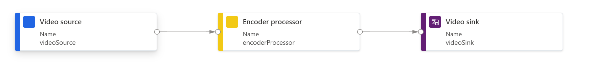

# Export a portion of a video archive to an MP4 file

This batch topology enables you to export a portion of a video archive to an MP4 file, using Azure Video Analyzer service. You can read more about the scenario in [this](https://docs.microsoft.com/azure/azure-video-analyzer/video-analyzer-docs/cloud/export-portion-of-video-as-mp4) article.

In the topology, you can see that it uses an encoder processor with a pre-build preset of "SingleLayer_1080p_H264_AAC", which is described in the [swagger file](https://github.com/Azure/azure-rest-api-specs/blob/master/specification/videoanalyzer/resource-manager/Microsoft.Media/preview/2021-11-01-preview/PipelineTopologies.json).

The time sequence is parameterized, allowing you to choose a desired start and end timestamp for each clip you export for the specified input video resource.

 

  

 
