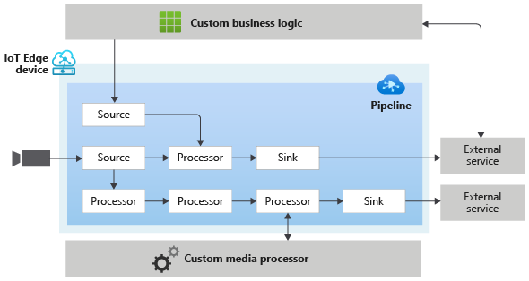

# Pipelines

Pipeline Topologies lets you define where media should be captured from, how it should be processed, and where the results should be delivered. A pipeline topology consists of source, processor, and sink nodes. The diagram below provides a graphical representation of a pipeline topology.  

 

  

 

A pipeline topology can have one or more of the following types of nodes:

* **Source nodes** enable capturing of media into the pipeline topology. Media in this context, conceptually, could be an audio stream, a video stream, a data stream, or a stream that has audio, video, and/or data combined together in a single stream.
* **Processor nodes** enable processing of media within the pipeline topology.
* **Sink nodes** enable delivering the processing results to services and apps outside the pipeline topology.

Azure Video Analyzer on IoT Edgeenables you to manage pipelines via two entities – “Pipeline Topology” and “Live Pipeline”. A pipeline enables you to define a blueprint of the pipeline topologies with parameters as placeholders for values. This pipeline defines what nodes are used in the pipeline topology, and how they are connected within it. A live pipeline enables you to provide values for parameters in a pipeline topology. The live pipeline can then be activated to enable the flow of data.

You can learn more about this in the [pipeline topologies](https://docs.microsoft.com/azure/azure-video-analyzer/video-analyzer-docs/pipeline) concept page.

