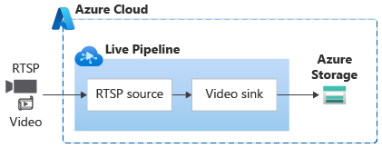

# Capture, record, and stream live video from a camera accessible over the internet

This topology enables you to capture, record, and stream live video from an RTSP-capable camera that is accessible over the intenet, using Azure Video Analyzer service. You can read more about the scenario in [this](https://docs.microsoft.com/azure/azure-video-analyzer/video-analyzer-docs/cloud/get-started-livepipelines-portal) article.

In the topology, you can see that it uses
* **segmentLength** of PT0M30S or 30 seconds, which means the service waits until at least 30 seconds of the video has been aggregated before it records it to Azure storage. Increasing the value of segmentLength has the benefit of further lowering your storage transaction costs. However, this will mean an increase in the delay before you can watch recorded content.
* **retentionPeriod** of 30 days, which means the service will periodically scan the video archive and delete content older than 30 days

The RTSP credentials and the video resource name (to which content will be archived) are parametrized - meaning you would specify unique values for these for each unique camera when creating a live pipeline under this topology.

 

  

 
