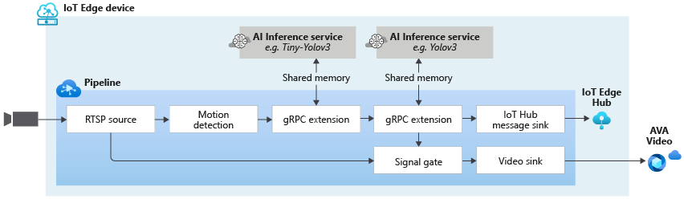

# Record an object of interest to AMS asset using multiple AI model

This topology enables you run 2 AI inferencing models of your choice. The video from an RTSP-capable camera is sent to an external AI which classifies vehicles in the video frame using [Tiny YoloV3 model](https://github.com/Azure/live-video-analytics/tree/master/utilities/video-analysis/notebooks/yolo/tinyyolov3/tinyyolov3-grpc-icpu-onnx). Only the classifed video frames are sent to another external AI which using the [YoloV3 model](https://github.com/Azure/live-video-analytics/tree/master/utilities/video-analysis/yolov3-onnx), detects an object of interest (a bicycle in this case). When the object of interest (bicycle) is detected, the inferencing (bounding box) data is sent to the IoT Hub and 30 second video clip is recorded as an Azure Media Service Asset.

Having such a topology enables you to trigger a heavy AI module, only when a light AI module indicates a need to do so.

 

  

 
