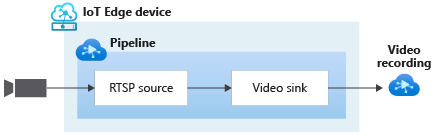

# Video and Audio topology

This topology enables you to continuously record video from an RTSP-capable camera to an Azure Video Analyzer Video. You can read more about the relevant settings in [this](https://github.com/Azure/video-analyzer/tree/main/pipelines/live/topologies/cvr-video-sink/readme.md) page.

Additionally, this topology enables you to record a video clip including the audio using the **outputSelectors** property.

 

  

 
