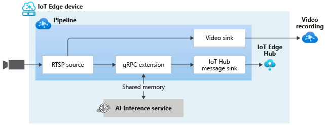

# Continuous video recording and inferencing using gRPC Extension

This topology enables you to continuously record the video from an RTSP-capable camera to an Azure Video Analyzer Video. You can read more about the relevant settings in [this](https://github.com/Azure/video-analyzer/tree/main/pipelines/live/topologies/cvr-video-sink/readme.md) page.

Additionally, this topology enables you to run video analytics on a live feed from an RTSP-capable camera. A subset of the video frames (controlled by the **samplingOptions** parameter in the gRPC extension node)is sent to an external AI inference engine using the **sharedMemory** mode for data transfer. The results are then published to the IoT Edge Hub.

 

  

 
