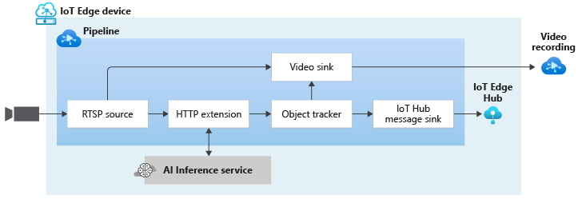

# Continuous video and inference metadata recording using HTTP Extension and Object Tracker

This topology enables you to continuously record the video from an RTSP-capable camera to an Azure Video Analyzer Video. You can read more about the relevant settings in [this](https://github.com/Azure/video-analyzer/tree/main/pipelines/live/topologies/cvr-video-sink/readme.md) page.

Additionally, this pipeline topology enables you to track objects in a live feed from an RTSP-capable camera. The object tracker comes in handy when you need to detect objects in every frame, but the edge device does not have the necessary compute power to be able to apply the vision model on every frame. The object tracker will also send the inference metadata to the video sink to be recorded and played back with the video. You can see how this topology is used in [this](https://docs.microsoft.com/azure/azure-video-analyzer/video-analyzer-docs/record-stream-inference-data-with-video) tutorial.

 

  

 
