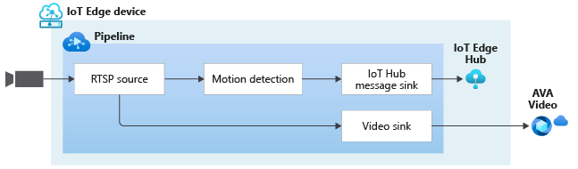

# Continuous video recording with Motion Detection

This topology enables you to continuously record the video from an RTSP-capable camera to an Azure Video Analyzer Video. Note that the topology also removes the audio before storing it as an Azure Video Analyzer Video. You can read more about the relevant settings in [this](https://github.com/Azure/video-analyzer/tree/main/pipelines/live/topologies/cvr-video-sink/readme.md) page.

Additionally, the video from the camera is analyzed for the presence of motion. When motion is detected, relevant inferencing events are published to the IoT Edge Hub.

 

  

 
