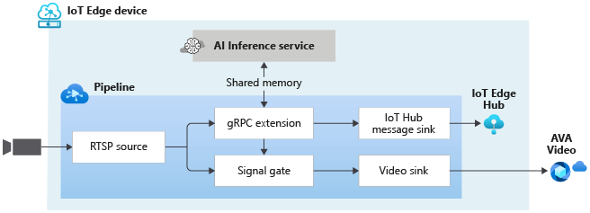

# Event-based video recording to AVA Video based on events from external AI

This topology enables you to perform event-based recording. When an event of interest is detected by the external AI service, those events are published to the IoT Edge Hub. In addition, the events are used to trigger the signal gate processor node which results in the creation of new assets containing clips where event of interest was detected.

 

  

 
