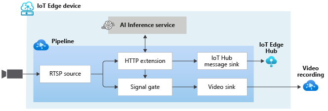

# Event-based video recording to AVA Video based on events from external AI

This topology enables you to perform event-based recording. When an event of interest is detected by the external AI service, those events are published to the IoT Edge Hub. In addition, the events are used to trigger the signal gate processor node which results in the appending of the video clips where event of interest was detected to the AVA video sink.

The important thing to note is that the AI service should be configured to return HTTP 204 status code when there is no object of interest. This is covered in the [yolov3 sample container](https://github.com/Azure/video-analyzer/tree/main/edge-modules/extensions/yolo/yolov3)

 

  

 
