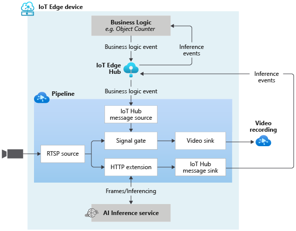

# Event-based video recording to Video Sink based on specific objects being detected by external inference engine

This topology enables you use to an object detection AI model to look for objects in the video, and record video clips only when a certain type of object is detected. The trigger to generate these clips is based on the AI inference events published onto the IoT Hub. You can read more about how to use this topology in [this](https://docs.microsoft.com/azure/azure-video-analyzer/video-analyzer-docs/record-event-based-live-video) tutorial.
 

  

 
