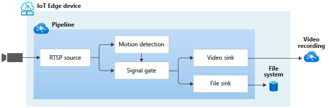

# Event-based video recording to video sink and local files based on motion events

This topology enables you perform event-based recording of video clips to the cloud as well as to the edge. The video from an RTSP-capable camera is analyzed for the presence of motion. When motion is detected, events are sent to a signal gate processor node which opens, allowing video to pass through to a file sink node as well as an video sink node. As a result, new files (MP4 format) are created on the local file system of the Edge device, and new video clips are appended to your Video file in the cloud. The recordings contain the frames where motion was detected.

Note: The topology creates new MP4 files each time motion is detected. Over time, this can fill up the local filesystem. You should monitor the contents of the output directory and prune older files as necessary. With the help of the **maximumSizeMiB** parameter in the FileSink node, you can now configure the maximum disk space on the Edge device that AVA can use to store these MP4 files. If the alloted disk space limit is reached, AVA will start deleting the older clips and replace them with the new ones.

 

  

 
