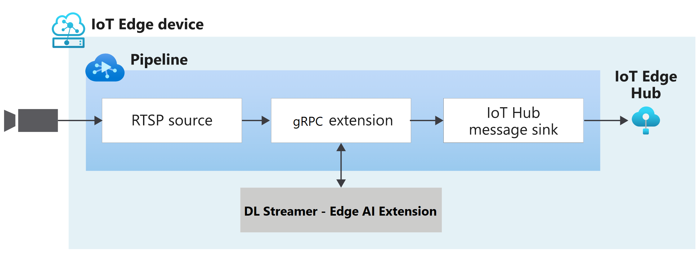

# Analyzing live video using gRPC Extension to send images to the OpenVINO(TM) DL Streamer - Edge AI Extension module from Intel

This topology enables you to run video analytics on a live feed from an RTSP-capable camera. The gRPC Extension allows you to create images at video frame rate from the camera that are converted to images, and sent to the [ OpenVINO(TM) DL Streamer - Edge AI Extension module from Intel](https://aka.ms/ava-intel-ovms) module. The results are then published to the IoT Edge Hub. You can see how this topology is used in [this](https://aka.ms/ava-intel-grpc) tutorial.

 

  

 
