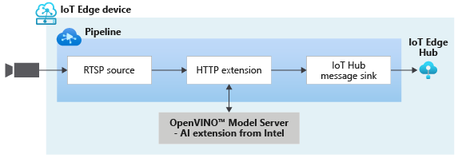

# Analyzing live video using HTTP Extension to send images to the OpenVINO™ Model Server – AI Extension module from Intel

This topology enables you to run video analytics on a live feed from an RTSP-capable camera. A subset of the video frames from the camera (as controlled by the frame rate filter processor node) are converted to images, and sent to the [OpenVINO™ Model Server – AI Extension](https://aka.ms/ava-intel-ovms) module provided by Intel. The results are then published to the IoT Edge Hub. You can see how this topology is used in [this](https://aka.ms/ava-intel-ovms-tutorial) tutorial.

 

  

 
