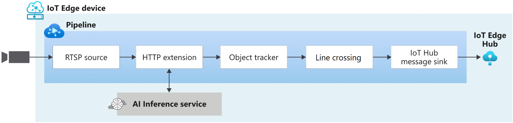

# Line crossing in live video

This topology enables you to use line crossing and get events when objects cross that line in a live rtsp video feed. It uses computer vision model to detect objects in a subset of the frames in the live video feed. The object tracker node is used to track those objects in the frames and pass them through a line crossing node.
The line crossing node comes in handy when you want to detect objects that cross the imaginary line and emit events. The events contain the direction (clockwise, counterclockwise) and a total counter per direction.

 

  

 
