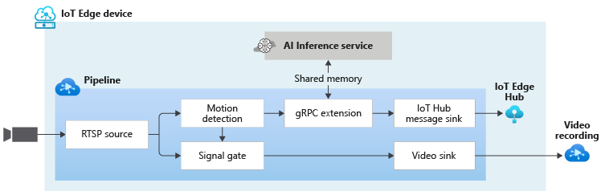

# Event-based video recording to Video Sink based on motion events, and using gRPC Extension to send images to an external inference engine

This topology enables you perform event-based recording. The video from an RTSP-capable camera is analyzed for the presence of motion. When motion is detected, those events are published to the IoT Edge Hub. In addition, the motion events are used to trigger a signal gate processor node which will send frames to an video sink node only when motion is present. As a result, new video clips are appended to the Video file in the cloud containing clips where motion was detected.

Additionally, this topology enables you to run video analytics only when motion is detected. Upon detecting motion, a subset of the video frames (as controlled by the frame rate filter processor node) are sent to an external AI inference engine. The results are then published to the IoT Edge Hub.

 

  

 
