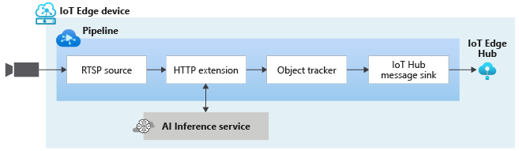

# Object tracking in live video

This pipeline topology enables you to track objects in a live feed from an RTSP-capable camera. The object tracker comes in handy when you need to detect objects in every frame, but the edge device does not have the necessary compute power to be able to apply the vision model on every frame. If the live video feed is at, say 30 frames per second, and you can only run your computer vision model on every 10th frame, the object tracker takes the results from one such frame, and then uses [optical flow](https://en.wikipedia.org/wiki/Optical_flow) techniques to generate results for the 2nd, 3rd,…, 9th frame, until the model is applied again on the next frame. You can see how this topology is used in [this](https://docs.microsoft.com/azure/azure-video-analyzer/video-analyzer-docs/track-objects-live-video) quickstart.

 

  

 