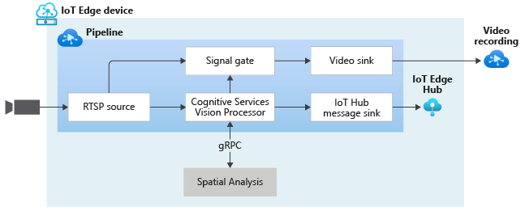

# Analyzing Live Video with Computer Vision for Spatial Analysis

The video from an RTSP-capable camera is sent to an external module ([spatialAnalysis](https://docs.microsoft.com/azure/cognitive-services/computer-vision/spatial-analysis-operations) which carries out a supported AI operation. When the criteria defined by the AI operation is met, events are sent to a signal gate processor which opens, sending the frames to a video sink node. As a result, a new clip is appended to the video resource. You can read more about how to use Azure Video Analyzer together with Computer Vision for Spatial Analysis AI service from Azure Cognitive Services in [this](https://aka.ms/ava-spatial-analysis) documentation page.

 

  

 
