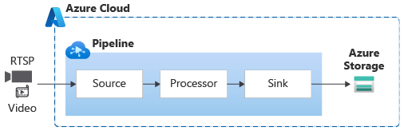

# Pipeline Topologies

A pipeline topology enables you to describe how live video or recorded video should be processed and analyzed for your custom needs through a set of interconnected nodes. Video analyzer supports two kinds of topologies: live and batch. Live topologies, as the name suggests, are used with live video from cameras. Batch topologies are used to process recorded videos.

A pipeline topology can have one or more of the following types of nodes:

* **Source nodes** enable capturing of media into the pipeline topology. Media in this context, conceptually, could be an audio stream, a video stream, a data stream, or a stream that has audio, video, and/or data combined together in a single stream.
* **Processor nodes** enable processing of media within the pipeline topology.
* **Sink nodes** enable delivering the processing results to services and apps outside the pipeline topology.

Pipelines can be defined and instantiated at the edge for on premises video processing, or in the cloud. The diagrams below provides graphical representations of such pipelines.  

 

  

   

  

 

You can create different topologies for different scenarios by selecting which nodes are in the topology, how they are connected, with parameters as placeholders for values. A pipeline is an individual instance of a specific pipeline topology. A pipeline is where media is actually processed. Pipelines can be associated with individual cameras or recorded videos through user defined parameters declared in the pipeline topology. Instances of a live topologies are called live pipelines, and instances of a batch topology are referred to as pipeline jobs. 

You can learn more about this in the [Pipeline](https://docs.microsoft.com/azure/azure-video-analyzer/video-analyzer-docs/pipeline) concept page.
